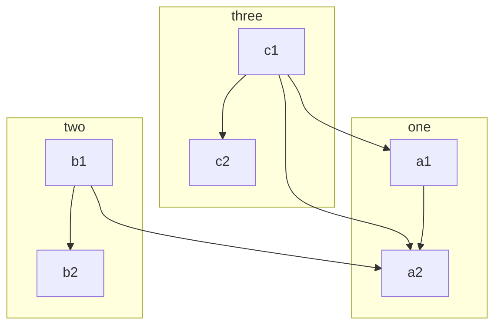
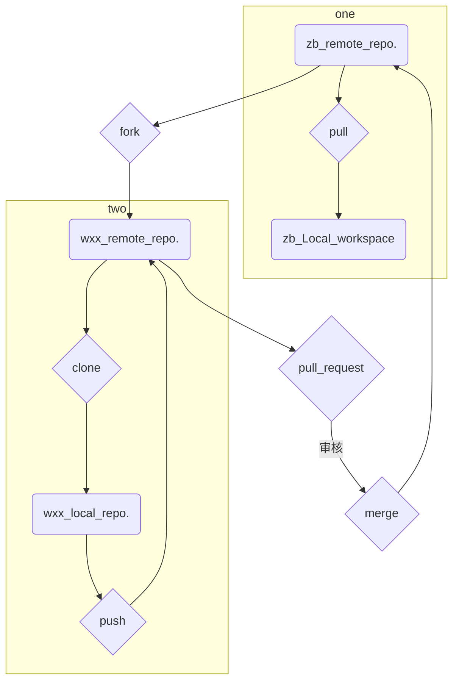
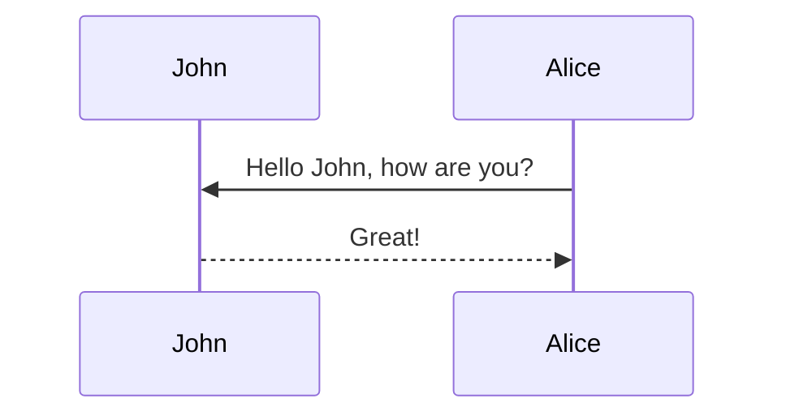
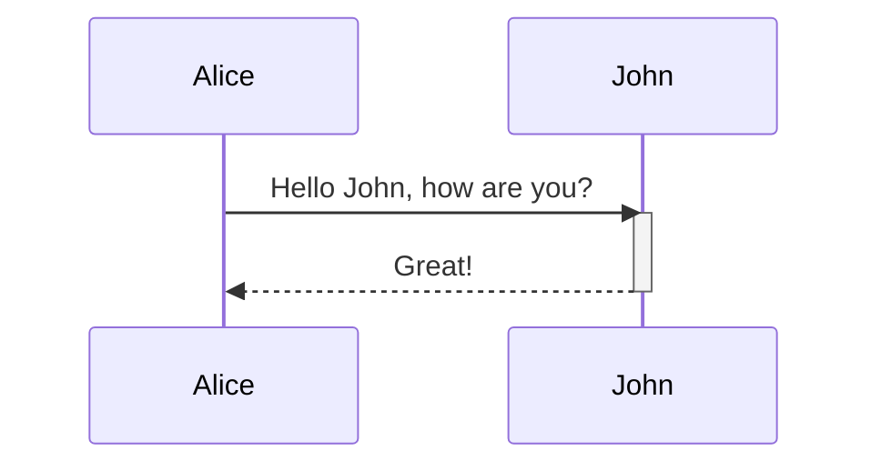
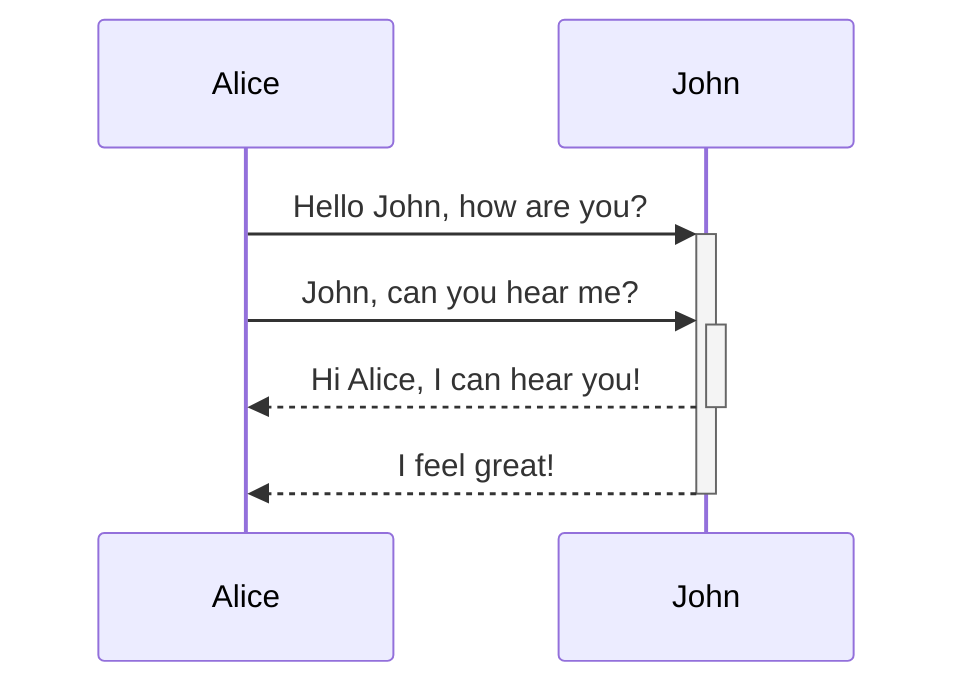
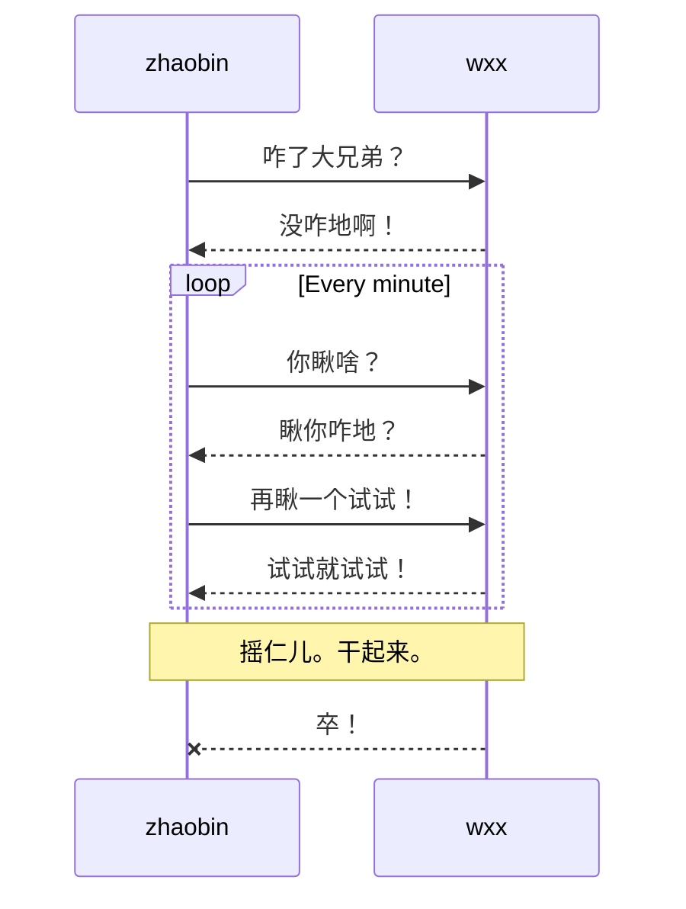
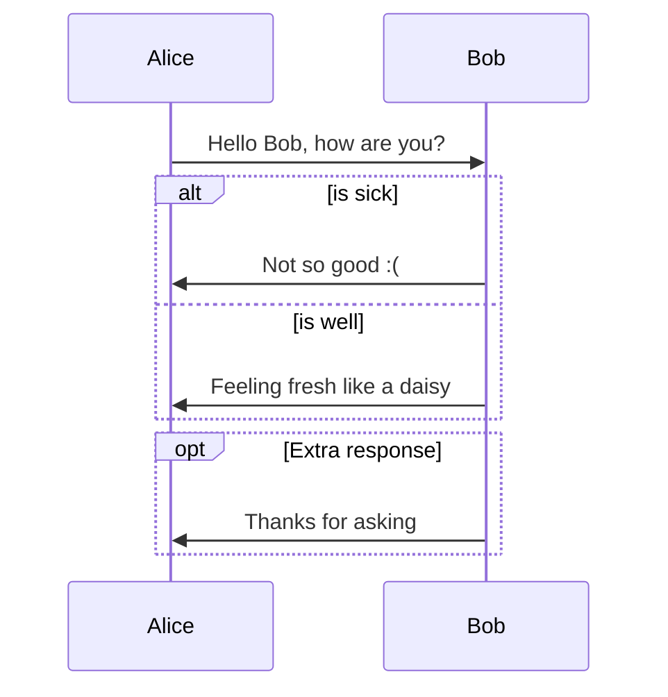
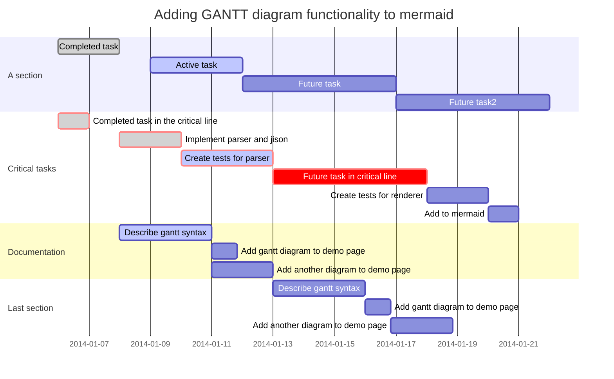

# 1. 开始吧

# 2. 图表（Diagrams）

## 2.1 流程图（FLowchar）

### （1）绘制方向（Graph）

+ TB - top bottom
+ BT - bottom top
+ RL - right left
+ LR - left right
+ TD - same as TB

```
graph LR
	Star --> Stop
```

### （2）节点和节点形状（Nodes & shapes）

【包裹文本外侧的符号不同区分形状】

+ 一个默认节点

    ```
    graph LR
    	id
    ```

    > 如果没有文本，
    >
    > id名直接展示在节点里，
    >
    > 默认是矩形的盒子。

    

+ 带文本的节点

    ```
    graph LR
        id1[This is the text in the box]
    ```

    > It is also possible to set text in the box that differs from the id. If this is done several times, it is the last text found for the node that will be used. Also if you define edges for the node later on, you can omit text definitions. The one previously defined will be used when rendering the box.

    

+ 圆角矩形的节点（A node with round edges）

    ```
    graph LR
        id1(This is the text in the box with round edges)
    ```

    

+ 圆形的节点

    ```
    graph LR
        id1((This is the text in the circle))
    ```

    

+ 不对称形节点（A node in an asymetric shape）

    ```
    graph LR
        id1>This is the text in the box]
    ```

    

+ 菱形节点（rhombus）

    ```mermaid
    graph LR
        id1{This is the text in the box}
    ```

    

+ 六边形节点（A hexagon node）

    ```
    graph LR
        id1{{This is the text in the box}}
    ```

    

+ 梯形节点（Trapezoid）

    ```
    graph TD
        A[/Christmas\]
    ```

    

+ 倒梯形节点（Trapezoid alt）

    ```
    graph TD
        B[\Go shopping/]
    ```

    

### （3）节点之间的连接（Links between nodes）

+ 带箭头的直线

    ```
    graph LR
        A-->B
    ```

    

+ 直线

    ```
    graph LR
        A --- B
    ```

    

+ 直线上带文本

    ```
    graph LR
        A-- This is the text ---B
    ```

    >注意：
    >
    >后面是三个短线，前面两个。

    

+ 带箭头的直线上面有文本（A Link with arrow head and text）

    ```
    graph LR
        A-- text -->B
    ```

    

+ 带箭头虚线（Dotted Link）

    ```
    graph LR;
       A-.->B;
    ```

    

+ 带箭头的虚线带着文本

    ```
    graph LR
       A-. text .-> B
    ```

    

+ 粗箭头线

    ```
    graph LR
       A ==> B
    ```

    

+ 粗箭头线带文本

    ```
    graph LR
       A == text ==> B
    ```

    

+ 链式连接

    ```
    graph LR
       A == text ==> B -. text2 .-> C
    ```

    

### （4）特殊字符（Special characters that break syntax）

>当文本中出现
>
>破坏语法规则的特殊字符：
>
>比如：()  {}  [] 

+ 英文双引号引起来：

    ```mermaid
    graph LR
        id1["This is the (text) in the box"]
    ```

    

+ 说明语法对字符进行转义

    ```mermaid
    graph LR
            A["A double quote:#quot;"] -->B["A dec char:#9829;"]
    ```

    

### （5）子图（Subgraphs）





### （6）交互图（Interaction）

### （7）样式和类（Styling and Classes）

1. Styling Links
2. Styling a node
3. Classes
4. CSS Classes
5. Default Classes


## 2.2 序列图（Sequence Diagram）

> 序列图是一个交互图，它显示进程如何相互操作以及以什么顺序进行操作。

### （1）参与者（Participants）

> 如果不提前定义参与者，将按照会话出现顺序展示



### （2）别名设置（aliases）

> 参与者可以具有方便的标识符和描述性标签

```
sequenceDiagram
    participant A as Alice
    participant J as John
    A->>J: Hello John, how are you?
    J->>A: Great!
```

### （3）会话消息（Messages）

>There are six types of arrows currently supported:

| Type |                 Description                 |
| :--: | :-----------------------------------------: |
|  ->  |          Solid line without arrow           |
| -->  |          Dotted line without arrow          |
| ->>  |          Solid line with arrowhead          |
| -->> |         Dotted line with arrowhead          |
|  -x  | Solid line with a cross at the end (async)  |
| --x  | Dotted line with a cross at the end (async) |


### （4）活动（Activations）



> 快捷方式：

```
sequenceDiagram
    Alice->>+John: Hello John, how are you?
    John-->>-Alice: Great!
```


### （5）活动的嵌套与叠加



### （6）注释

1. Note [ right of | left of | over ] [Actor]: Text in note content

    ```mermaid
    sequenceDiagram
        John --> zhaobin: 咋的了大兄弟？
        Note left of John: 我是猪食
    ```

    

2. 创建跨越两个参与者的注释

    ```
    sequenceDiagram
        Alice->John: Hello John, how are you?
        Note over Alice,John: A typical interaction
    ```

    

### （6）循环（Loops）



### （7）选择路径（Alt）（Alternative Paths）

1. express alternative paths

```
alt Describing text
... statements ...
else
... statements ...
end
```

2. if there is sequence that is optional (if without else).

```
opt Describing text
... statements ...
end
```




### （8）背景高亮

```
rect rgba(0, 0, 255, .1)
... content ...
end
```


### （9）样式（Styling）

### （10）配置（Configuration）

## 2.3 类图（Class Diagram）

## 2.4 状态图（State Diagram）

## 2.5 甘特图（Gantt）

> 甘特图是条形图的一种.
>
> 最早由Karol Adamiecki于1896年开发，由Henry Gantt在1910年代独立开发.
>
> 用于说明项目进度表。 
>
> 甘特图说明了项目的终端元素和摘要元素的开始和结束日期。

```
gantt
    title A Gantt Diagram
    dateFormat  YYYY-MM-DD
    section Section
    A task           :a1, 2014-01-01, 30d
    Another task     :after a1  , 20d
    section Another
    Task in sec      :2014-01-12  , 12d
    another task      : 24d
```





## 2.6 饼图（Pie Chart）

```
[pie] [title] [titlevalue] (OPTIONAL)
"[datakey1]" : [dataValue1]
"[datakey2]" : [dataValue2]
"[datakey3]" : [dataValue3]
```


```
pie
    title Key elements in Product X
    "Calcium" : 42.96
    "Potassium" : 50.05
    "Magnesium" : 10.01
    "Iron" :  5
```


## 2.7 Git版本图（）


# 3. Guide


##  
